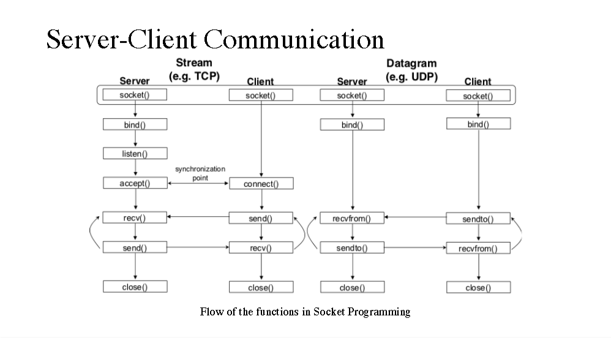
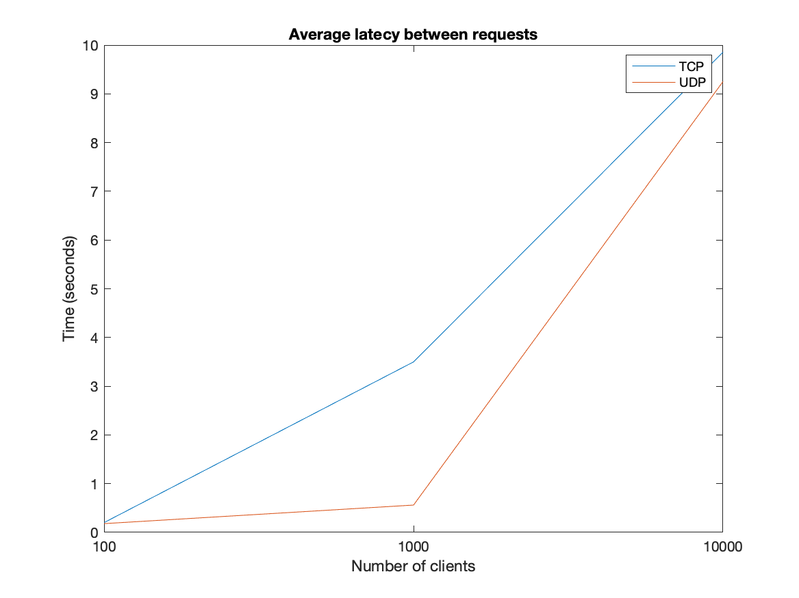
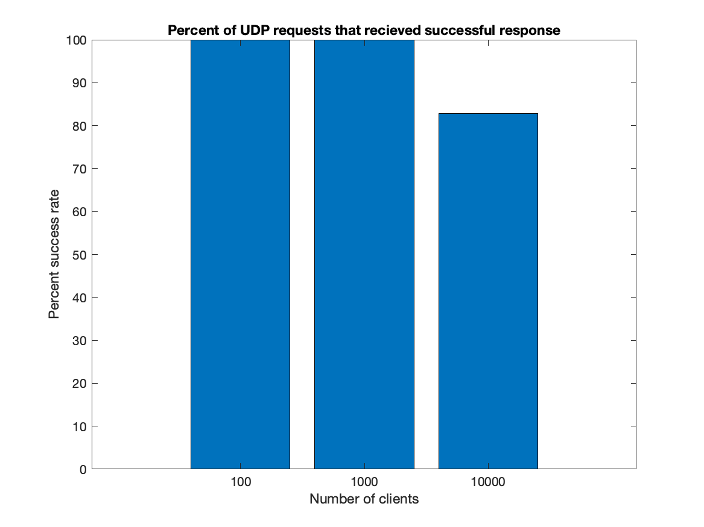

# A Web-Server Model
The goal of this lab is to develop an understanding surrounding the fundamental operations of web services as well as gain experience in Socket network programming in C. This project shows us valuable insight into the differences in speed and capability of connectionless and connection-oriented services by gathering real-time performance metrics for large numbers of connected clients. 
The major tasks performed were:- 
- creating the webserver which can handle HTTP requests for both TCP and UDP, for multiple clients, which was build using parent-child architecture a
- creating a client that can connect to the corresponding server with the same protocol and able to request and store Html pages.  

## How to run:
### Build code
1. `git clone git@lobogit.unm.edu:fall19group4/lab2.git`
2. `cd lab2`
3. `make`
### Start the webserver

4. `./webserver ${port} ${type}`
    - `port` is the desired port that clients will connect to, and must be a value between 8000 and 9000.
    - `type` is the protocol for connection, and must be either `TCP` or `UDP`.  
### Run a client (option 1)

5. `./client http://${ip}:${port}/lab2.html ${type}`
    - `ip` is the IP address of the server
    - `port` is the port number for connection to the server, and must match the port above
    - `type` is again the connection type, and should match the type above.  

### Run a client (option 2)

5. `./client http://${ip}:${port} ${type}`
    - `ip` is the IP address of the server
    - `port` is the port number for connection to the server, and must match the port above
    - `type` is again the connection type, and should match the type above.  
At the command prompt: `What is the file or path you are requesting?`, enter `lab2.html` or a corresponding filename or path you would like to retrieve. 

This option was added based on the Lab2 instructions under **Building Your Own Client**: "If the user didn’t use the URL option then after a successful connection to the server, an inquiry in the terminal should appear and ask for the user to input a URL."

## Components:

The webserver and webclient are created in two corresponding files: `webserver.c` and `client.c`.

### webserver.c

The `webserver.c` file is responsible for creating an instance of webserver used for handling http requests from one or more client with both TCP and UDP protocols. This file depends on external files like `notfound.html`, `comic.gif`, and `lab2.html` for processing the client requests. These files, other than header file are stores using c file handling. The default port used by the server is 8080 but it's flexible to use other ports *(recommended 8000~9000)*. The webserver processes request using 2 protocols, TCP and UDP. Below is an overview of the architecture of both protocols.

TCP protocol, being a connection-oriented protocol, is implemented using `start_TCP_server` where it performs the necessary functionalities of opening a socket binding, listening for connections and accepting them as shown in the above figure. Once a connection is accepted a child process is created using *fork()* and then `TCP_handle_request` is called for further processing of client requests. This function takes the argument as an accepted client socket, initializes a buffer for the incoming request message and then parses the client request and performs validation on it. On successful validation, the server sends the appropriate file requested by calling `TCP_send_files` function, from where the appropriate HTML files are sent. If the correct file was requested by client the server sends the lab2.html file with .gif file embedded in it, else a standard 404 html page is sent if the requested file is not correct. The connection is closed upon the successful completion of the request.

Similar to TCP protocol, UDP protocol is implemented but with its corresponding functionality. UDP is a connectionless protocol, unlike TCP, only socket binding is done and it is set to receive the connections from the client as shown in the diagram above.  Once the socket is bound, a buffer is created for handling requests and as soon as any client message is received a child process is created using *fork()* and then `UDP_handle_request` is called for further processing of client requests. Inside this function, the request is parsed and the appropriate file is transferred, similar to TCP. The only catch here is that UDP must remember the address it received from (there isn't a connected socket to pipe output through) and it doesn't close its socket connection even after processing the client request.

### client.c

The `client.c` file creates a webclient that connects to a webserver, and sends a GET request for the `lab2.html` file. While running the webclient, the user specifies the URL containing the IP and Port of the webserver to connect to, while also specifying whether to communicate with the server with TCP or UDP. The webclient then creates a socket and connects to the webserver, while also preparing a formatted GET request that will point to the right file. 

After creating a socket, connecting to the server, and formatting the GET request, the webclient writes to the socket with the GET request. If the GET request was sent with TCP, then the client will get a response from the server which indicates whether or not the operation was successful. If the write operation is unsuccessful, the client will receive `-1`. Values greater than -1 indicate that the write operation was a success. In preparation to read from the socket, the client then creates a buffer, and sets all the values in the buffer to 0. The client then reads from the buffer twice, first to get the html file from the server, and second to get the gif. Each time, the results are stored in a buffer. The results are then written to a file, and the file is opened in the Firefox browser.

## Latency Testing
For testing latency in file transfer we used 100, 1,000, and 10,000 clients run simultaneously using a .bash file.  To test latency we checked elapsed time with help of the `time.h` library and a monotonic clock.  The `client.c` program captured the times before the GET request was sent and after all files were received, and used this to calculate the elapsed time between requesting files from the server and receiving them.  

Figure 1 shows the latency in seconds of TCP and UDP requests for increasing amounts of clients.  As expected, 100 clients results in low latency.  1,000 clients shows higher latency using TCP connections, because of the added overhead that comes alongside a TCP connection.  At 10,000 clients, latency is much higher, and still higher for TCP connections.

Figure 1.  Latency between TCP and UDP connections.

Figure 2 shows the percent of received webpages when testing on 100, 1,000, and 10,000 clients. There are no packages dropped for relatively small numbers of clients, but when 10,000 clients request the same webpage using UDP protocol, only 80% of packages arrive when requested.

Figure 2.  Percent of delivered packets in UDP connections. 

These results largely as expected.  Significantly more UDP packets are dropped as UDP makes absolutely no guarantee of messages being delivered without dropped packets.  The lack of congestion control does make the latency significantly better, but it also appeared to overwhelm the network as the server would boot any ssh users in the team for the duration of the test.  It should also be noted that this data is presented with about 20 "dropped connections" taken out in the more extreme TCP tests, but these were invariably due to socket timeouts; all timeouts occurred after almost exactly 100 seconds of hanging.

## Contributions
Thomas wrote the original UDP server, troubleshot and debugged the client and server, and optimized the code for latency testing.  He also provided the bulk of the last-minute code to make the server respond in true HTTP format.

Carolyn wrote the original TCP client, and ran and created charts for the latency tests.

Nitin contributed to the UDP client. 

Cat wrote the original TCP server and command-line parsing for robust input.  She also handled bad requests and page not found requests, as well as contributed to the last-minute code addition of adding a header to outgoing server messages. 
